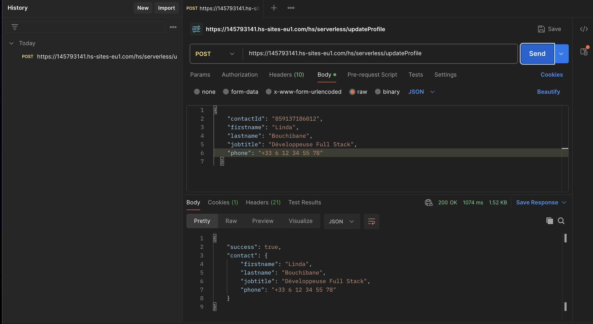

# Acme Cloud — Portail client HubSpot CMS React

Test technique réalisé sur le portail sandbox **Test UI Extensions** (ID 145793141).

Le projet est découpé en deux projets HubSpot séparés : un thème CMS React et une app serverless.

---

## Installation

Il faut avoir le CLI HubSpot installé et être authentifié sur le portail.

```bash
npm install -g @hubspot/cli
hs auth
# Sélectionner "test-ui-extensions" (145793141)
```

Avant de déployer la partie serverless, ajouter le secret :

```bash
hs secret add HS_ACCESS_TOKEN
```

> Le token utilisé est celui de l'app Digitalisync (portail 145793141). Voir la section "Points bloquants".

Déployer les deux projets :

```bash
# Thème
cd theme && hs project upload

# App serverless
cd serverless && hs project upload
```

---

## Les 3 pages

| Page | URL | Accès |
|---|---|---|
| Accueil | https://145793141.hs-sites-eu1.com/accueil-linda | Public |
| Catalogue | https://145793141.hs-sites-eu1.com/offres-linda | Public |
| Mon compte | https://145793141.hs-sites-eu1.com/mon-compte-linda | Membership requis |

---

## Page Catalogue — source de données

J'ai créé une table HubDB `acme_offres` (ID `3659409600`) directement dans le portail via Data Management → HubDB, avec 5 enregistrements.

**Colonnes affichées :**

| Colonne | Type | Rôle |
|---|---|---|
| `name` | Texte | Nom du produit |
| `description` | Texte long | Description de l'offre |
| `price` | Nombre | Prix en €/mois |
| `category` | Texte | Catégorie — badge + filtre |

La lecture se fait côté serveur via HubL (`hubdb_table_rows`) dans le template, et les données sont injectées en JSON dans un `<script type="application/json">`. L'Island React les lit depuis le DOM au chargement. Ce choix s'explique par le fait que l'API REST HubDB requiert une authentification même pour les tables publiées, ce qui rendrait la lecture client-side impossible sans exposer un token.

L'Island gère la recherche fulltext sur le nom et la description, le filtre par catégorie, les états loading / vide / erreur, et une vue détail par offre.

---

## Endpoint serverless — updateProfile

```
POST /hs/serverless/updateProfile
Content-Type: application/json
```

**Payload :**

```json
{
  "contactId": "12345",
  "firstname": "Linda",
  "lastname": "Bouchibane",
  "jobtitle": "Développeuse Full Stack",
  "phone": "+33 6 12 34 56 78"
}
```

`contactId` est obligatoire. Les quatre autres champs sont optionnels mais au moins un doit être présent. Tout autre champ dans le body est ignoré — seuls `firstname`, `lastname`, `jobtitle` et `phone` passent la whitelist.

**Réponse succès :**

```json
{
  "success": true,
  "contact": {
    "firstname": "Linda",
    "lastname": "Bouchibane",
    "jobtitle": "Développeuse Full Stack",
    "phone": "+33 6 12 34 56 78"
  }
}
```

**Réponses erreur :**

```json
{ "success": false, "error": "Paramètre contactId manquant." }            // 400
{ "success": false, "error": "Aucune propriété valide à mettre à jour." } // 400
{ "success": false, "error": "Contact introuvable." }                     // 404
{ "success": false, "error": "Erreur interne. Veuillez réessayer." }      // 500
```

**Test Postman — 200 OK :**



---

## Points bloquants

Le nom de secret `PRIVATE_APP_ACCESS_TOKEN` est réservé par HubSpot et rejeté à l'upload du projet — j'ai donc utilisé `HS_ACCESS_TOKEN` à la place.

### Test end-to-end de Mon compte

L'envoi d'emails d'invitation membership est bloqué sur ce portail. Le message HubSpot est explicite : *"A custom domain must be connected to send invite emails."* Le portail utilisant `hs-sites-eu1.com`, impossible d'envoyer une invitation sans domaine personnalisé.

C'est une limitation documentée des portails sandbox :
- https://community.hubspot.com/t5/CMS-Development/Sandbox-testing-private-content-membership/td-p/635204
- https://knowledge.hubspot.com/website-pages/manage-private-content-settings

L'implémentation est complète côté code (template HubL, ProfileIsland, serverless). L'endpoint a été testé et validé via Postman — voir capture ci-dessus.

---

## Architecture

```
Template HubL
  └── Module SSR (index.jsx)
        └── Island React (client, interactivité)
              └── POST /hs/serverless/updateProfile
                    └── @hubspot/api-client → CRM HubSpot
```


